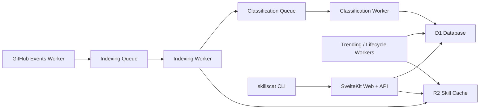

<p align="center">
  
</p>

<h1 align="center">SkillsCat</h1>

<p align="center">
  <strong>An open AGPL-3.0 platform for discovering, sharing, and installing AI agent skills.</strong>
</p>

<p align="center">
  <a href="https://pnpm.io/"></a>
  <a href="https://kit.svelte.dev/"></a>
  <a href="https://developers.cloudflare.com/workers/"></a>
  <a href="LICENSE"></a>
</p>

<p align="center">
  <a href="#quick-start">Quick Start</a>
  |
  <a href="#architecture">Architecture</a>
  |
  <a href="#common-commands">Commands</a>
  |
  <a href="#license">License</a>
</p>

## Why SkillsCat

| Registry | Installation | Operations |
| --- | --- | --- |
| Search trending/top/recent skills and browse category collections. | Install skills with browser and CLI workflows. | Run a queue-based worker pipeline for indexing, classification, and ranking. |

## Architecture



## Monorepo Layout

```text
skillscat/
├── apps/
│   ├── web/   # SvelteKit web app + Cloudflare workers
│   └── cli/   # skillscat CLI package
├── scripts/   # bootstrap and environment tooling
├── LICENSE
└── README.md
```

## Tech Stack

- Runtime: Node.js + TypeScript
- Package manager: pnpm workspaces
- Orchestration: Turborepo
- Web: SvelteKit, UnoCSS, Better Auth, Drizzle ORM
- Infrastructure: Cloudflare Workers, D1, R2, KV, Queues
- CLI: Commander + Rollup

## Quick Start

1. Install dependencies:

```bash
pnpm install
```

2. Initialize project configuration:

```bash
pnpm init:project
```

Optional modes:

```bash
pnpm init:local
pnpm init:production
```

3. Start the web app:

```bash
pnpm dev:web
```

## Common Commands

| Command | Description |
| --- | --- |
| `pnpm build` | Build the web app |
| `pnpm build:cli` | Build the CLI package |
| `pnpm typecheck` | Run TypeScript checks across workspace |
| `pnpm lint` | Run ESLint |
| `pnpm test:cli` | Run CLI tests |
| `pnpm db:generate` | Generate Drizzle migrations |
| `pnpm db:migrate` | Apply database migrations |
| `pnpm deploy` | Deploy web/workers to Cloudflare |
| `pnpm publish:cli` | Publish CLI package |

## Web and CLI Notes

### `apps/web`

- SvelteKit SSR app and route handlers
- Registry/auth/user/org APIs
- Worker sources for ingestion, classification, trending, and lifecycle jobs

### `apps/cli`

- `skillscat` command-line interface for search/install/publish/update/auth flows
- Source: `apps/cli/src`
- Build output: `apps/cli/dist`

## Environment Templates

- `apps/web/.dev.vars.example`
- `apps/web/wrangler.*.toml.example`

## License

This project is licensed under **AGPL-3.0**. See [`LICENSE`](LICENSE).
