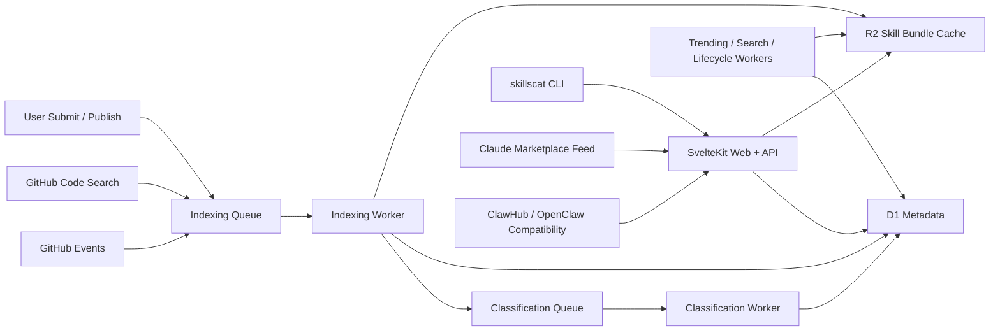

<p align="center">
  
</p>

<h1 align="center">SkillsCat</h1>

<p align="center">
  <strong>An open platform for discovering, publishing, and installing AI agent skills.</strong>
</p>

<p align="center">
  <a href="https://pnpm.io/"></a>
  <a href="https://kit.svelte.dev/"></a>
  <a href="https://developers.cloudflare.com/workers/"></a>
  <a href="LICENSE"></a>
</p>

<p align="center">
  <a href="#why-skillscat">Why SkillsCat</a>
  |
  <a href="#what-we-support">What We Support</a>
  |
  <a href="#how-we-collect-skills">How We Collect Skills</a>
  |
  <a href="#architecture">Architecture</a>
  |
  <a href="#quick-start">Quick Start</a>
  |
  <a href="#common-commands">Commands</a>
</p>

## Why SkillsCat

SkillsCat is a Cloudflare-first registry and CLI for reusable AI agent skills.

- Discover public skills through the website, JSON registry APIs, and search tooling
- Publish private or public skills through native SkillsCat workflows
- Install full skill bundles, not just `SKILL.md`, into local agent directories
- Precompute search, recommendations, and ranking data with background workers
- Expose compatibility surfaces for ecosystems outside the native `skillscat` CLI

## What We Support

| Surface | What it does | Entry point |
| --- | --- | --- |
| Native SkillsCat registry | Search, inspect, install, publish, and manage skills via the website and `skillscat` CLI | `https://skills.cat/registry`, `https://skills.cat/api`, `npx skillscat ...` |
| Claude Code Marketplace feed | Exposes public GitHub-backed skills as Claude Marketplace-compatible plugins | `https://skills.cat/marketplace.json` |
| ClawHub-compatible registry | Lets `clawhub` CLI and OpenClaw clients discover, install, update, and publish against SkillsCat | `https://skills.cat/.well-known/clawhub.json`, `https://skills.cat/openclaw` |
| Local agent installs | Materializes skills into Claude Code, OpenClaw, Cursor, Codex, and other local agent layouts | `npx skillscat add <source> --agent <agent>` |

## How We Collect Skills

SkillsCat uses both automated discovery and user-driven submission:

1. `github-events` polls the GitHub Events API on a cron schedule and queues candidate repositories.
2. The same discovery flow uses budget-aware GitHub Code Search with `filename:SKILL.md` to find more repos.
3. Users can manually submit GitHub repositories through the web app or `npx skillscat submit <repo-url>`.
4. Users can directly publish local skill bundles with `npx skillscat publish <path>`.
5. The `indexing` worker fetches repository metadata, extracts `SKILL.md`, caches companion text files to R2, and writes searchable records to D1.
6. `classification`, `search-precompute`, `trending`, `tier-recalc`, `archive`, and `resurrection` workers keep categories, rankings, cache state, and lifecycle data fresh.

This pipeline is designed to keep request-time D1 reads low, reuse Cloudflare Cache API and R2 where possible, and avoid repeated GitHub fetches for the same skill bundle.

## Architecture


```mermaid
flowchart LR
  A["GitHub Events"] --> D["Indexing Queue"]
  B["GitHub Code Search"] --> D
  C["User Submit / Publish"] --> D
  D --> E["Indexing Worker"]
  E --> F["Classification Queue"]
  F --> G["Classification Worker"]
  E --> H["D1 Metadata"]
  E --> I["R2 Skill Bundle Cache"]
  G --> H
  J["Trending / Search / Lifecycle Workers"] --> H
  J --> I
  K["SvelteKit Web + API"] --> H
  K --> I
  L["skillscat CLI"] --> K
  M["Claude Marketplace Feed"] --> K
  N["ClawHub / OpenClaw Compatibility"] --> K
```

## Monorepo Layout

```text
skillscat/
├── apps/
│   ├── web/   # SvelteKit app, API routes, Cloudflare bindings, workers, D1 migrations
│   └── cli/   # skillscat CLI package
├── scripts/   # project bootstrap, deploy, release, and Cloudflare resource tooling
├── LICENSE
└── README.md
```

## Tech Stack

- Workspace: `pnpm` workspaces
- Web: SvelteKit 2, Svelte 5, UnoCSS, Better Auth
- Database: Drizzle ORM + Cloudflare D1
- Infra: Cloudflare Workers, R2, KV, Queues, Cache API
- CLI: Commander, Rollup, TypeScript
- Testing: Vitest

## Quick Start

1. Install dependencies:

```bash
pnpm install
```

2. Initialize project configuration:

```bash
pnpm init:project
```

This setup flow auto-generates local secrets such as `BETTER_AUTH_SECRET`, `WORKER_SECRET`, and `INDEXNOW_KEY` when needed.

Optional setup modes:

```bash
pnpm init:local
pnpm init:production
```

3. Start the web app:

```bash
pnpm dev:web
```

4. Build or preview when needed:

```bash
pnpm build
pnpm preview:web
```

## Common Commands

| Command | Description |
| --- | --- |
| `pnpm dev:web` | Run the SvelteKit web app locally |
| `pnpm build` | Build the web app |
| `pnpm build:cli` | Build the CLI package |
| `pnpm typecheck` | Run TypeScript checks across the workspace |
| `pnpm lint` | Run ESLint |
| `pnpm db:generate` | Generate Drizzle migrations from schema changes |
| `pnpm db:migrate` | Apply local D1 migrations |
| `pnpm test:cli` | Run CLI tests |
| `pnpm deploy` | Deploy the web app |
| `pnpm deploy:workers` | Deploy background workers |
| `pnpm publish:cli` | Publish the CLI package |

## Web and CLI Notes

### `apps/web`

- SvelteKit SSR app plus route handlers for registry, auth, search, submit, and publish flows
- Cloudflare-first runtime with D1, R2, KV, Queues, Cache API, and Worker bindings
- Compatibility endpoints for Claude Marketplace and ClawHub/OpenClaw

### `apps/cli`

- Native `skillscat` CLI for install, search, submit, publish, auth, and update workflows
- Supports local install targets such as Claude Code, OpenClaw, Cursor, Codex, and more
- Source lives in `apps/cli/src`

## Environment Templates

- `apps/web/.dev.vars.example`
- `apps/web/wrangler.preview.toml.example`

## License

This project is licensed under **AGPL-3.0**. See [`LICENSE`](LICENSE).
